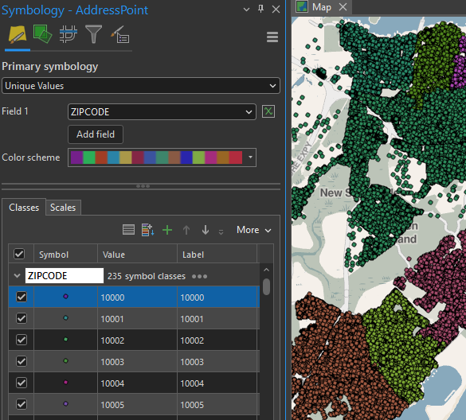
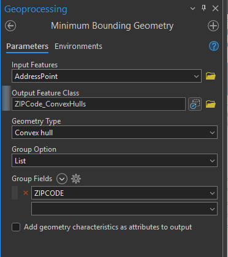
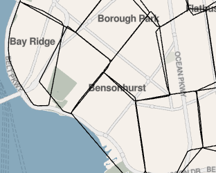
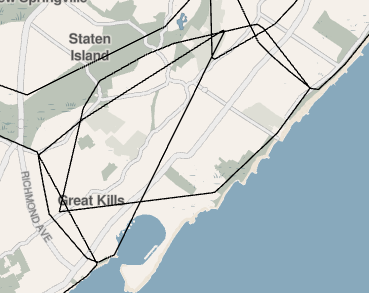
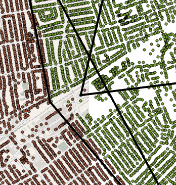

## Visually Review CSCL AddressPoint ZIPCODE values

This is a companion to the density cluster analysis [described here](../README.md#qa-zip-codes). Thanks to M.E. from ESRI professional services for the suggestion.

1. Add the CSCL AddressPoint feature class to ArcGIS Pro
2. Symbolize with unique values based on ZIP Codes.  
3. Choose a bold color scheme. None of this default pastel basic random. Be serious.

4. Make convex hulls using the "Minimum Bounding Geometry Tool"

5. Eyeball convex hull overlaps

pretty good

not good

6. Turn on your AddressPoint symbology and get in there for a closer look.

7. When evaluating individual AddressPoint ZIP code values you will want to use 3rd party sources. Look up business contact info. See what Open Street Map and Google Maps have to say about the address. Be creative.